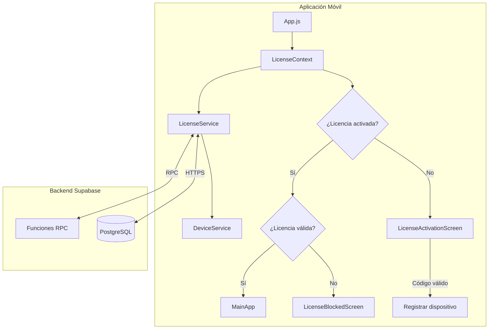
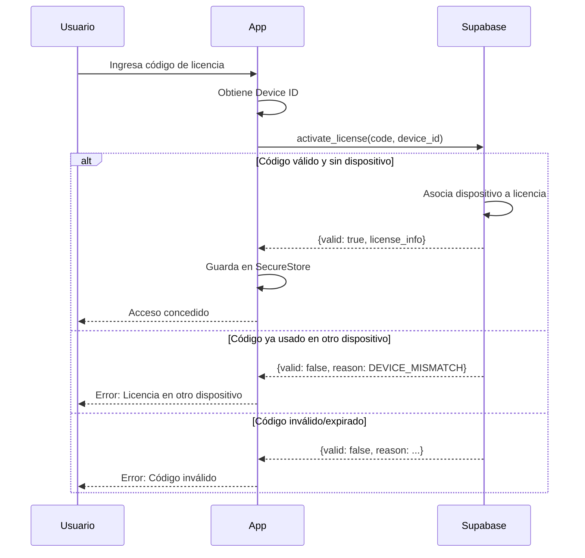

# Plan de Implementación: Sistema de Licenciamiento con Código Único

## Descripción del Problema

Se requiere implementar un sistema de licenciamiento para la aplicación móvil "Woodland Studio" (React Native/Expo) basado en **códigos de licencia únicos** (sin cuentas de usuario) que permita:
- Restringir el acceso cuando la licencia expire
- Mantener los datos locales intactos durante el bloqueo
- Controlar el uso por dispositivo único
- Permitir reactivación tras confirmación de pago externo

---

## Decisiones Confirmadas

| Aspecto | Decisión |
|---------|----------|
| **Autenticación** | Código de licencia único (sin email/password) |
| **Backend** | Supabase (PostgreSQL + RLS) |
| **Modo Offline** | 7 días de período de gracia |
| **Bloqueo** | Lógico (datos intactos) |

---

## Arquitectura Propuesta



---

## Flujo de Activación



---

## Proposed Changes

### Backend Supabase (Configuración Manual)

> [!NOTE]
> Estas instrucciones se ejecutan en el panel de Supabase → SQL Editor

#### Esquema de Base de Datos

```sql
-- Tabla de licencias (sin referencia a auth.users)
CREATE TABLE licenses (
    id UUID PRIMARY KEY DEFAULT gen_random_uuid(),
    license_code TEXT UNIQUE NOT NULL,
    client_name TEXT,
    client_phone TEXT,
    start_date TIMESTAMP WITH TIME ZONE DEFAULT NOW(),
    end_date TIMESTAMP WITH TIME ZONE NOT NULL,
    status TEXT DEFAULT 'active' CHECK (status IN ('active', 'blocked', 'expired')),
    device_id TEXT,
    device_registered_at TIMESTAMP WITH TIME ZONE,
    last_validation TIMESTAMP WITH TIME ZONE,
    notes TEXT,
    created_at TIMESTAMP WITH TIME ZONE DEFAULT NOW(),
    updated_at TIMESTAMP WITH TIME ZONE DEFAULT NOW()
);

-- Índices para mejor rendimiento
CREATE INDEX idx_licenses_code ON licenses(license_code);
CREATE INDEX idx_licenses_device ON licenses(device_id);
CREATE INDEX idx_licenses_status ON licenses(status);

-- Trigger para actualizar updated_at
CREATE OR REPLACE FUNCTION update_updated_at()
RETURNS TRIGGER AS $$
BEGIN
    NEW.updated_at = NOW();
    RETURN NEW;
END;
$$ LANGUAGE plpgsql;

CREATE TRIGGER licenses_updated_at
    BEFORE UPDATE ON licenses
    FOR EACH ROW
    EXECUTE FUNCTION update_updated_at();
```

#### Función para Activar Licencia

```sql
CREATE OR REPLACE FUNCTION activate_license(p_license_code TEXT, p_device_id TEXT)
RETURNS JSON
LANGUAGE plpgsql
SECURITY DEFINER
AS $$
DECLARE
    license_record RECORD;
BEGIN
    -- Buscar licencia por código
    SELECT * INTO license_record
    FROM licenses
    WHERE license_code = UPPER(TRIM(p_license_code));
    
    -- Si no existe la licencia
    IF NOT FOUND THEN
        RETURN json_build_object(
            'valid', false,
            'reason', 'INVALID_CODE',
            'message', 'El código de licencia ingresado no es válido.'
        );
    END IF;
    
    -- Verificar si la licencia está bloqueada
    IF license_record.status = 'blocked' THEN
        RETURN json_build_object(
            'valid', false,
            'reason', 'LICENSE_BLOCKED',
            'message', 'Esta licencia ha sido bloqueada. Contacte al administrador.'
        );
    END IF;
    
    -- Verificar si la licencia expiró
    IF license_record.end_date < NOW() THEN
        UPDATE licenses SET status = 'expired' WHERE id = license_record.id;
        RETURN json_build_object(
            'valid', false,
            'reason', 'LICENSE_EXPIRED',
            'message', 'Esta licencia ha expirado. Contacte al administrador para renovar.',
            'expired_at', license_record.end_date
        );
    END IF;
    
    -- Si la licencia ya tiene un dispositivo asociado
    IF license_record.device_id IS NOT NULL THEN
        -- Verificar si es el mismo dispositivo
        IF license_record.device_id = p_device_id THEN
            -- Actualizar última validación
            UPDATE licenses 
            SET last_validation = NOW()
            WHERE id = license_record.id;
            
            RETURN json_build_object(
                'valid', true,
                'reason', 'LICENSE_VALID',
                'license_id', license_record.id,
                'license_code', license_record.license_code,
                'client_name', license_record.client_name,
                'end_date', license_record.end_date,
                'days_remaining', EXTRACT(DAY FROM license_record.end_date - NOW())
            );
        ELSE
            -- Dispositivo diferente
            RETURN json_build_object(
                'valid', false,
                'reason', 'DEVICE_MISMATCH',
                'message', 'Esta licencia ya está activada en otro dispositivo. Solo se permite un dispositivo por licencia.'
            );
        END IF;
    END IF;
    
    -- Registrar dispositivo por primera vez
    UPDATE licenses 
    SET 
        device_id = p_device_id,
        device_registered_at = NOW(),
        last_validation = NOW()
    WHERE id = license_record.id;
    
    RETURN json_build_object(
        'valid', true,
        'reason', 'DEVICE_REGISTERED',
        'message', 'Licencia activada exitosamente.',
        'license_id', license_record.id,
        'license_code', license_record.license_code,
        'client_name', license_record.client_name,
        'end_date', license_record.end_date,
        'days_remaining', EXTRACT(DAY FROM license_record.end_date - NOW())
    );
END;
$$;
```

#### Función para Validar Licencia (revalidación periódica)

```sql
CREATE OR REPLACE FUNCTION validate_license(p_license_code TEXT, p_device_id TEXT)
RETURNS JSON
LANGUAGE plpgsql
SECURITY DEFINER
AS $$
DECLARE
    license_record RECORD;
BEGIN
    SELECT * INTO license_record
    FROM licenses
    WHERE license_code = UPPER(TRIM(p_license_code))
      AND device_id = p_device_id;
    
    IF NOT FOUND THEN
        RETURN json_build_object(
            'valid', false,
            'reason', 'LICENSE_NOT_FOUND',
            'message', 'Licencia no encontrada para este dispositivo.'
        );
    END IF;
    
    IF license_record.status = 'blocked' THEN
        RETURN json_build_object(
            'valid', false,
            'reason', 'LICENSE_BLOCKED',
            'message', 'Esta licencia ha sido bloqueada.'
        );
    END IF;
    
    IF license_record.end_date < NOW() THEN
        UPDATE licenses SET status = 'expired' WHERE id = license_record.id;
        RETURN json_build_object(
            'valid', false,
            'reason', 'LICENSE_EXPIRED',
            'message', 'Su licencia ha expirado.',
            'expired_at', license_record.end_date
        );
    END IF;
    
    UPDATE licenses SET last_validation = NOW() WHERE id = license_record.id;
    
    RETURN json_build_object(
        'valid', true,
        'reason', 'LICENSE_VALID',
        'end_date', license_record.end_date,
        'days_remaining', EXTRACT(DAY FROM license_record.end_date - NOW())
    );
END;
$$;
```

#### Función para Generar Códigos de Licencia (Administrador)

```sql
CREATE OR REPLACE FUNCTION generate_license(
    p_client_name TEXT DEFAULT NULL,
    p_client_phone TEXT DEFAULT NULL,
    p_days_valid INTEGER DEFAULT 365,
    p_notes TEXT DEFAULT NULL
)
RETURNS JSON
LANGUAGE plpgsql
SECURITY DEFINER
AS $$
DECLARE
    new_code TEXT;
    new_license RECORD;
BEGIN
    -- Generar código único en formato XXXX-XXXX-XXXX
    new_code := UPPER(
        SUBSTRING(MD5(RANDOM()::TEXT) FROM 1 FOR 4) || '-' ||
        SUBSTRING(MD5(RANDOM()::TEXT) FROM 1 FOR 4) || '-' ||
        SUBSTRING(MD5(RANDOM()::TEXT) FROM 1 FOR 4)
    );
    
    -- Asegurar que no exista
    WHILE EXISTS (SELECT 1 FROM licenses WHERE license_code = new_code) LOOP
        new_code := UPPER(
            SUBSTRING(MD5(RANDOM()::TEXT) FROM 1 FOR 4) || '-' ||
            SUBSTRING(MD5(RANDOM()::TEXT) FROM 1 FOR 4) || '-' ||
            SUBSTRING(MD5(RANDOM()::TEXT) FROM 1 FOR 4)
        );
    END LOOP;
    
    INSERT INTO licenses (license_code, client_name, client_phone, end_date, notes)
    VALUES (new_code, p_client_name, p_client_phone, NOW() + (p_days_valid || ' days')::INTERVAL, p_notes)
    RETURNING * INTO new_license;
    
    RETURN json_build_object(
        'success', true,
        'license_code', new_license.license_code,
        'client_name', new_license.client_name,
        'end_date', new_license.end_date,
        'days_valid', p_days_valid
    );
END;
$$;
```

#### Políticas de Seguridad (RLS)

```sql
-- Habilitar RLS
ALTER TABLE licenses ENABLE ROW LEVEL SECURITY;

-- Política para llamadas RPC (anon puede validar licencias)
-- Las funciones son SECURITY DEFINER, así que ejecutan con permisos del owner
-- No se necesitan políticas SELECT para el usuario anon si solo usamos RPC
```

#### Configurar permisos para funciones RPC

```sql
-- Permitir que usuarios anónimos llamen las funciones de validación
GRANT EXECUTE ON FUNCTION activate_license(TEXT, TEXT) TO anon;
GRANT EXECUTE ON FUNCTION validate_license(TEXT, TEXT) TO anon;

-- La función generate_license solo debe ser accesible desde el dashboard
-- o con service_role key (no dar acceso a anon)
```

---

### Dependencias Nuevas

#### [MODIFY] package.json

```json
  "dependencies": {
    "@supabase/supabase-js": "^2.39.0",
    "expo-application": "~6.0.0",
    "expo-secure-store": "~14.0.0",
    ...
  }
```

---

### Services

#### [NEW] services/supabaseClient.js

Cliente de Supabase configurado para uso sin autenticación.

#### [NEW] services/DeviceService.js

Obtención de identificador único del dispositivo Android.

#### [NEW] services/LicenseService.js

Servicio para activar, validar y manejar cache offline.

---

### Context

#### [NEW] context/LicenseContext.js

Contexto que maneja el estado global de la licencia.

---

### Screens

#### [NEW] screens/LicenseActivationScreen.js

Pantalla para ingresar código de licencia.

#### [NEW] screens/LicenseBlockedScreen.js

Pantalla de bloqueo (licencia expirada o bloqueada).

---

### Integración Principal

#### [MODIFY] App.js

Envolver la app con `LicenseProvider`.

#### [MODIFY] app.json

Agregar plugin `expo-secure-store`.

---

## Verificación

| # | Escenario | Resultado Esperado |
|---|-----------|-------------------|
| 1 | Código inválido | Error correspondiente |
| 2 | Código válido | Activación exitosa |
| 3 | Otro dispositivo | Error de coincidencia |
| 4 | Offline | Funciona hasta 7 días |

---

## Administración de Licencias

Ejecutar en SQL Editor de Supabase:

```sql
-- Crear licencia
SELECT generate_license('Nombre Cliente', '3001234567', 365);

-- Ver todas
SELECT * FROM licenses;
```

---

## Cronograma de Implementación

1. **Fase 1:** Configuración Supabase (~20 min)
2. **Fase 2:** Servicios (~45 min)
3. **Fase 3:** Contexto (~30 min)
4. **Fase 4:** Pantallas (~75 min)
5. **Fase 5:** Integración y Pruebas (~50 min)
